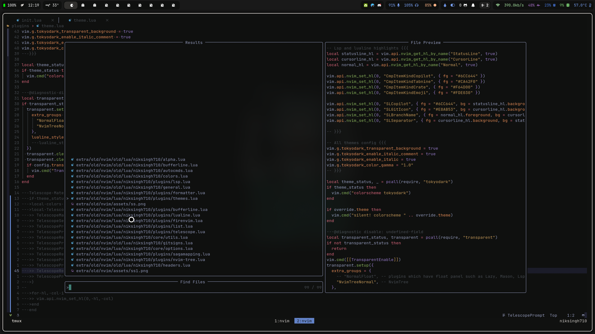
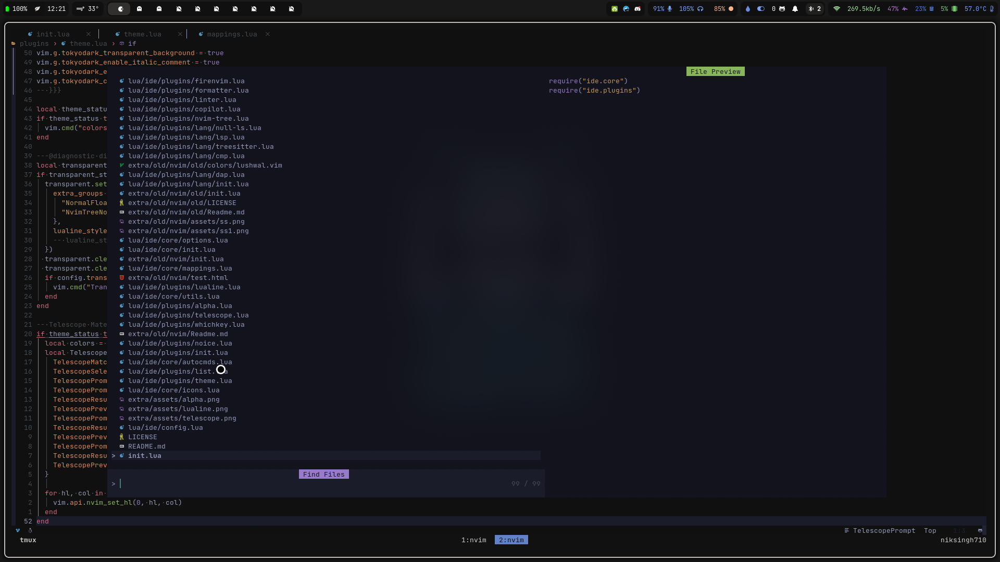

# Tips for nvim native users.

- [Lua](#Lua)
  - [Comment](#comment)
  - [Variables](#variables)
  - [Comparison](#comparison-operators)
  - [Conditionals](#conditional-statements)
  - [Combining Statements](#combining-statements)
  - [Inversion](#invert-value)
  - [Functions](#functions)
  - [Scope](#scope)
  - [Loops](#loops)
    - [While](#while)
    - [For](#for)
  - [Tables](#tables)
  - [Arrays](#arrays)
  - [Dictionaries](#dictionaries)
  - [Nested Tables](#nested-tables)
  - [Modules](#modules)
- [Vim Api](#vim-api)
- [Telescope](#telescope-tips)
- [Cmdline](#cmdline)
- [Tmux](#tmux)
- [Mappings](#mapping)
- [Telescope and NvimTree](#telescope-and-nvimtree)
- [Plugins](#plugins)

## Lua

Lua is a programming language used in configuring nvim.
so bit basics would be helpful.

- This section of lua basics is from [NvChad Docs](https://nvchad.com/docs/quickstart/learn-lua)
<!--{{{-->

#### Comment

```lua
print("Hi") -- comment

--[[
 multi-line
 comment
]]

```

#### Variables

```lua

-- Different types

local x = 10 -- number
local name = "sid" -- string
local isAlive = true -- boolean
local a = nil --no value or invalid value

-- increment in numbers
local n = 1
n = n + 1
print(n) -- 2

-- strings
-- Concatenate strings
local phrase = "I am"
local name = "Sid"

print(phrase .. " " .. name) -- I am Sid
print("I am " .. "Sid")
```

#### Comparison Operators

```lua
 == equality
 < less than
 > greater than
 <= less than or equal to
 >= greater than or equal to
 ~= inequality
```

#### Conditional Statements

```lua
-- Number comparisons
local age = 10

if age > 18 then
  print("over 18") -- this will not be executed
end

-- elseif and else
age = 20

if age > 18 then
  print("over 18")
elseif age == 18 then
  print("18 huh")
else
  print("kiddo")
end

-- Boolean comparison
local isAlive = true

if isAlive then
    print("Be grateful!")
end

-- String comparisons
local name = "sid"

if name ~= "sid" then
  print("not sid")
end
```

#### Combining Statements

```lua
local age = 22

if age == 10 and x > 0 then -- both should be true
  print("kiddo!")
elseif x == 18 or x > 18 then -- 1 or more are true
  print("over 18")
end

-- result: over 18
```

#### Invert Value

You can also invert a value with the not keyword:

```lua

local isAlive = true

if not isAlive then
  print(" ye ded!")
end
```

#### Functions

```lua
local function print_num(a)
  print(a)
end
or

local print_num = function(a)
  print(a)
end

print_num(5) -- prints 5

-- multiple parameters
function sum(a, b)
  return a + b
end
```

#### Scope

Variables have different scopes. Once the end of the scope is reached, the values in that scope are no longer accessible.

```lua

function foo()
  local n = 10
end

print(n) -- nil , n isn't accessible outside foo()

```

#### Loops

Different ways to make a loop:

###### While

```lua
local i = 1

while i <= 3 do
   print("hi")
   i = i + 1
end
```

###### For

```lua
for i = 1, 3 do
   print("hi")
end
-- Both print "hi" 3 times
```

#### Tables

- Tables can be used to store complex data.
- Types of tables: arrays (lists) and dicts (key,value)

#### Arrays

- Items within these can be accessed by "index".

```lua
local colors = { "red", "green", "blue" }

print(colors[1]) -- red

-- Different ways to loop through lists
-- #colors is the length of the table, #tablename is the syntax

for i = 1, #colors do
  print(colors[i])
end

-- ipairs
for index, value in ipairs(colors) do
   print(colors[index])
   -- or
   print(value)
end

-- If you dont use index or value here then you can replace it with _
for _, value in ipairs(colors) do
   print(value)
end
```

#### Dictionaries

- These contain keys and values:

```lua

local info = {
   name = "sid",
   age = 20,
   isAlive = true
}

-- both print sid
print(info["name"])
print(info.name)

-- Loop by pairs
for key, value in pairs(info) do
   print(key .. " " .. tostring(value))
end

-- prints name sid, age 20 etc

```

#### Nested Tables

```lua

-- Nested lists
local data = {
    { "sid", 20 },
    { "tim", 90 },
}

for i = 1, #data do
  print(data[i][1] .. " is " .. data[i][2] .. " years old")
end

-- Nested dictionaries
local data = {
    sid = { age = 20 },
    tim = { age = 90 },
}

```

#### Modules

Import code from other files

```lua
require("path")

-- for example in ~/.config/nvim/lua , all dirs and files are accessable via require
-- Do know that all files in that lua folder are in path!
-- ~/.config/nvim/lua/custom
-- ~/.config/nvim/lua/custom/init.lua

 require "custom"

-- both do the same thing
```

<!--}}}-->

## Vim Api

Understanding some of the internal functions and variables in Vim can be quite helpful for enhancing your productivity. One particularly powerful function is `vim.inspect`.

This function allows you to neatly display Lua tables in a well-formatted manner.

This makes it significantly easier to comprehend the contents and values within the table, aiding you in gaining a clearer understanding of the data structure.

```lua

local tbl = {
    name = "sid",
    age = 20,
    isAlive = true,
    colors = { "red", "green", "blue" },
}
vim.inspect(tbl)
-- output
--[[
{
  age = 20,
  colors = {
    1 = "red",
    2 = "green",
    3 = "blue",
  },
  isAlive = true,
  name = "sid",
}
]]--
```

## Telescope Tips

Let's make our telescope look like a bit nicer (NvChad and Nyoom do this)
here we will do it for our nvim config.

| Before                                             | After                                            |
| -------------------------------------------------- | ------------------------------------------------ |
|  |  |

This has been done by changing nvim highlight groups.
I love using `tokyodark.nvim` theme you can find it [here](https://github.com/tiagovla/tokyodark.nvim)

I will be using this theme to change the highlight groups.

```lua
-- I used vim.inspect to get color palette from tokyodark.nvim
-- vim.inspect(require("tokyodark.palette"))
local colors = require("tokyodark.palette")
local TelescopeColor = {
    TelescopeMatching = { fg = colors.orange },
    TelescopeSelection = { fg = colors.fg, bg = colors.bg1, bold = true },
    TelescopePromptPrefix = { bg = colors.bg1 },
    TelescopePromptNormal = { bg = colors.bg1 },
    TelescopeResultsNormal = { bg = colors.bg0 },
    TelescopePreviewNormal = { bg = colors.bg0 },
    TelescopePromptBorder = { bg = colors.bg1, fg = colors.bg1 },
    TelescopeResultsBorder = { bg = colors.bg0, fg = colors.bg0 },
    TelescopePreviewBorder = { bg = colors.bg0, fg = colors.bg0 },
    TelescopePromptTitle = { bg = colors.purple, fg = colors.bg0 },
    TelescopeResultsTitle = { fg = colors.bg0 },
    TelescopePreviewTitle = { bg = colors.green, fg = colors.bg0 },
}

for hl, col in pairs(TelescopeColor) do
    vim.api.nvim_set_hl(0, hl, col)
end
```

Putting this much in your config will change your telescope look completly.

If you want this to be a theme independent you can define your own colors and use them.

```lua
local colors = {
    bg = "#282c34",
    fg = "#abb2bf",
    yellow = "#e0af68",
    cyan = "#56b6c2",
    darkblue = "#081633",
    green = "#98c379",
    orange = "#d19a66",
    violet = "#a9a1e1",
    magenta = "#c678dd",
    blue = "#61afef",
    red = "#e86671",
}

local TelescopeColor = {
    TelescopeMatching = { fg = colors.orange },
    TelescopeSelection = { fg = colors.fg, bg = colors.bg, bold = true },
    TelescopePromptPrefix = { bg = colors.bg },
    TelescopePromptNormal = { bg = colors.bg },
    TelescopeResultsNormal = { bg = colors.bg },
    TelescopePreviewNormal = { bg = colors.bg },
    TelescopePromptBorder = { bg = colors.bg, fg = colors.bg },
    TelescopeResultsBorder = { bg = colors.bg, fg = colors.bg },
    TelescopePreviewBorder = { bg = colors.bg, fg = colors.bg },
    TelescopePromptTitle = { bg = colors.purple, fg = colors.bg },
    TelescopeResultsTitle = { fg = colors.bg },
    TelescopePreviewTitle = { bg = colors.green, fg = colors.bg },
}
for hl, col in pairs(TelescopeColor) do
    vim.api.nvim_set_hl(0, hl, col)
end
```

This is from an comment on reddit [post](https://www.reddit.com/r/neovim/comments/xcsatv/how_can_i_configure_telescope_to_look_like_this/)

## Cmdline

You can use [noice.nvim](https://github.com/folke/noice.nvim) from folke.
But if you want a minimal feel with full vim like editing in cmdline.

try `q:` this will open a buffer with all your history and you can edit it like a normal buffer.
and pressing `<cr>` on the line hovered will execute it.

if you like `q:` then below are a few mappings and options you may like

```lua
vim.opt.cmdwinheight = 1,
vim.opt.cmdheight = 0,

vim.opt.wildcharm = ("\t"):byte() -- so that tab key can be remapped

vim.keymap.set("c", ":", "q:", {})
vim.keymap.set("n", ":", "q:i", {})
vim.keymap.set("c", "<c-j>", "<Tab>", {})
vim.keymap.set("c", "<c-k>", "<s-Tab>", {})

```

## Tmux

You use tmux then there are a few tips that may enhance your experience.

[vim-tmux-navigator](https://github.com/christoomey/vim-tmux-navigator) is a plugin that allows you to navigate between vim and tmux panes seamlessly.

Mappings in `tmux.conf`

```tmux

# christoomey Mappings {{{

# Smart pane switching with awareness of vim and fzf
forward_programs="view|n?vim?|fzf|lvim"

should_forward="ps -o state= -o comm= -t '#{pane_tty}' |\
  grep -iqE '^[^TXZ ]+ +(\\S+\\/)?g?($forward_programs)(diff)?$'"

bind -n C-h if-shell "$should_forward" "send-keys C-h" "select-pane -L"
bind -n C-j if-shell "$should_forward" "send-keys C-j" "select-pane -D"
bind -n C-k if-shell "$should_forward" "send-keys C-k" "select-pane -U"
bind -n C-l if-shell "$should_forward" "send-keys C-l" "select-pane -R"
bind -n C-\\ if-shell "$should_forward" "send-keys C-\\" "select-pane -l"
# }}}

```

Now you can switch focus between panes using `c-h,c-j,c-k,c-l`


## Mapping

```lua
-- This fn will allow you to map easily
map = function(mode, mappings, opts)
	-- enabled easy mapping syntax
	-- local mapping = {
	--  ["jk"] = "<esc>",
	--  ["<c-s>"] = { ":w<cr>", "Save" },
	-- }
	-- map( "n", mapping, {})

	for k, v in pairs(mappings) do
		opts = opts or {}
		local default = {
			noremap = true,
			silent = true,
		}
		opts = vim.tbl_deep_extend("force", default, opts)
		local value = v
		local desc = ""
		if type(v) == "table" then
			value, desc = v[1], v[2]
		end
		opts["desc"] = desc
		vim.keymap.set(mode, k, value, opts)
	end
end

-- Some Mappings you may find usefull.

local normal = {
	["<c-s>"] = { "<cmd>w<cr>", "Save the file" },
	["<c-h>"] = { "<c-w>h", "Focus on right split" },
	["<c-j>"] = { "<c-w>j", "Focus on below split" },
	["<c-k>"] = { "<c-w>k", "Focus on up split" },
	["<c-l>"] = { "<c-w>l", "Focus on left split" },
	["<c-a-j>"] = { ":resize -1<cr>", "Resize down" },
	["<c-a-k>"] = { ":resize +1<cr>", "Resize up" },
	["<c-a-l>"] = { ":vertical resize -1<cr>", "Resize right" },
	["<c-a-h>"] = { ":vertical resize +1<cr>", "Resize left" },
	["<c-a-=>"] = { "<C-a>", "Increase Number" }, ["<c-a-->"] = { "<C-x>", "Decrease Number" },

	["<a-j>"] = { ":m .+1<cr>==", "Move line Down" },
	["<a-k>"] = { ":m .-2<cr>==", "Move line up" },

	["<s-h>"] = { ":bprevious<cr>", "Buffer Previous" },
	["<s-l>"] = { ":bnext<cr>", "Buffer Next" },

	["<leader>q"] = { ":quit!<cr>", "Quit!" },
	-- ["<leader>c"] = { ":bd!<cr>", "Close!" },
	["<leader>c"] = { "<cmd>lua utils.close_buffer()<cr>", "Close!" }, -- Custom fn to ensure if this is the last buffer then quit nvim
	["<leader>h"] = { ":nohl<cr>", "No Highlight!" },
	["<leader>a"] = { "gg0vG$", "Select All" },
	["<leader>vv"] = { "<cmd>vsplit<cr>", "vertical split" },
	["<leader>vs"] = { "<cmd>split<cr>", "horizontal split" },
	["<leader>tj"] = { "<cmd>tabn<cr>", "Next Tab" },
	["<leader>tk"] = { "<cmd>tabp<cr>", "Previous Tab" },
	["<leader>tl"] = { "<cmd>tabn<cr>", "Next Tab" },
	["<leader>th"] = { "<cmd>tabp<cr>", "Previous Tab" },

	["<leader>tq"] = { "<cmd>tabclose<cr>", "Close Tab" },
	["<leader>tn"] = { "<cmd>tabnew<cr>", "New Tab" },

	---@diagnostic disable-next-line: undefined-global
	["<leader><leader>"] = { utils.filetypeSet, "Set Filetype" },

	-- highlight are in center
	["n"] = "nzzzv",
	["N"] = "Nzzzv",
	["x"] = '"_x',
}

local insert = { -- as these are insert mode mapping they don't need descriptions
	["jk"] = "<esc>",
	-- ["kj"] = "<esc>",
	["<esc>"] = "<esc>", -- Copilot unmaps esc in insert mode
	["<c-s>"] = "<esc>:w<cr>",
	["<a-j>"] = "<esc>:m .+1<cr>==gi",
	["<a-k>"] = "<esc>:m .-2<cr>==gi",
}

local visual = {
	["<c-s>"] = "<esc>:w<cr>",
	["<c-c>"] = "<esc>",

	["<a-j>"] = ":m '>+1<cr>gv-gv",
	["<a-k>"] = ":m '<lt>-2<CR>gv-gv",

	["<"] = "<gv",
	[">"] = ">gv",

	["<space>"] = "<Nop>",

	["x"] = '"_x',
	["p"] = '"_dP',
	["P"] = '"_dP',

	["<leader>y"] = '"+y',
	["<leader>d"] = '"+d',
	["<leader>Y"] = 'gg"+yG',
	["<leader>D"] = 'gg"+dG',
	["<leader>x"] = '"+x',
	["<leader>X"] = '"+',
}
map("n", normal)
map("i", insert)
map("x", visual)

```

## Telescope and Nvimtree
If you use these two plugins you may be finding it annoying when opening your file from home directory.
And then using `Telescope find_files` to find out it is searching in home dir instead of the buffer path.
The solution i came up with is a fn that will change the dir to the current buffer.
```lua
local set_currdir = function()
	local curdir = vim.fn.expand("%:p:h")
	vim.api.nvim_set_current_dir(curdir)
end

vim.keymap.set("<leader><cr>", set_currdir, {})

```
Now i just press `leader<cr>` and location of Telescope and nvim tree changes to current buffer

## Plugins

Not mentioning plugins like lsp, null-ls (rn Archieved), telescope, treesitter, etc. as you will eventully face them.

- [nvim-surround](https://github.com/kylechui/nvim-surround) At first will fea like a gimmick but once you get used to it you will love it.
- [firenvim](https://github.com/glacambre/firenvim) Brwoser and nvim integration. I use it for editing text in browser. Get your neovim config in browser text boxes.


- [vimium-c](https://github.com/gdh1995/vimium-c) Browser extension to use vim like keys in browser. 
